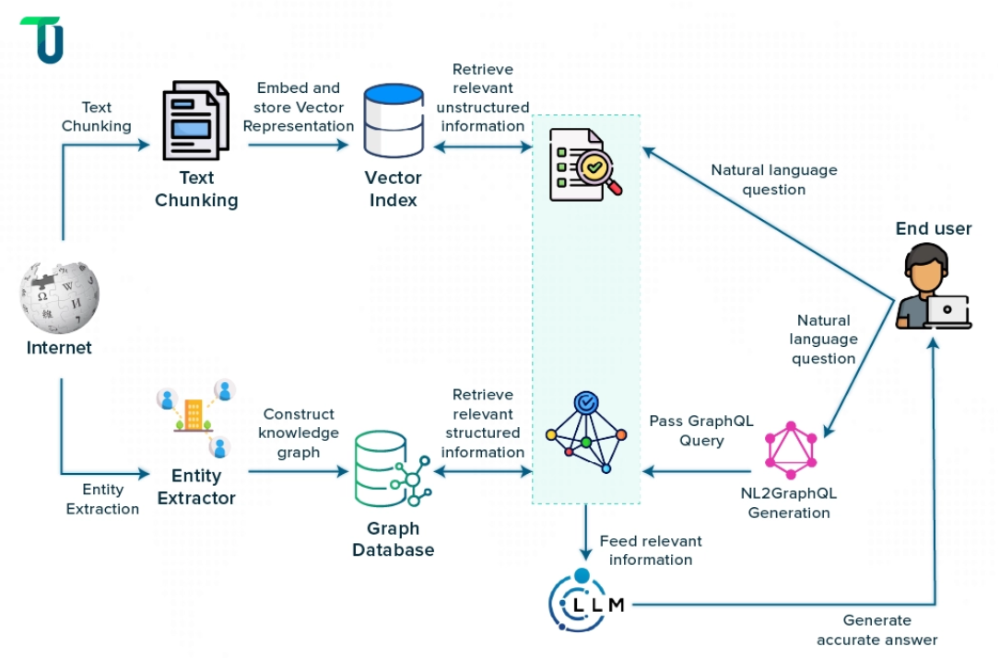

**Hybrid RAG System: Vector + Knowledge Graph**



**Articles**

https://www.qed42.com/insights/how-knowledge-graphs-take-rag-beyond-retrieval

https://learnprompting.org/docs/retrieval_augmented_generation/hybridrag?srsltid=AfmBOor9RpE8hbFT4Zff1cHvrOIUB902fpG8piRHViBIhU3lGfOn1TRQ

https://arxiv.org/pdf/2408.04948

## 🚀 Features

- **Hybrid Search**: Combines vector similarity search with knowledge graph relationships
- **Local LLM Support**: Full OLLAMA integration for privacy and cost efficiency
- **Multiple Search Strategies**: Auto, vector-only, graph-only, and hybrid modes
- **Production Ready**: Docker Compose setup with nginx, health checks, and security
- **Easy Setup**: Automated scripts for quick deployment
- **Comprehensive Validation**: Input sanitization and error handling

## 🏗️ Architecture

1. **Vector Database**: Qdrant (fast, scalable, Docker-native)
2. **Knowledge Graph**: Neo4j (industry standard for graph databases)
3. **LLM Interface**: OpenAI API (GPT-4) or local models via Ollama
4. **Query Router**: Intelligent routing between vector and graph search
5. **Context Synthesizer**: Combines results from both sources
6. **API Gateway**: FastAPI-based REST interface

## 📋 Prerequisites

- Docker and Docker Compose
- At least 8GB RAM (for OLLAMA models)
- 20GB free disk space

## 🛠️ Quick Start

### 1. Clone and Setup

```bash
git clone <repository-url>
cd HybridRag
```

### 2. Run Setup Script

```bash
# Make scripts executable (Linux/Mac)
chmod +x scripts/*.sh

# Run setup (Windows)
./scripts/setup.sh
```

The setup script will:
- Create necessary directories
- Set up environment variables
- Pull OLLAMA models (llama2, nomic-embed-text)
- Start all services

### 3. Manual Setup (Alternative)

```bash
# Copy environment file
cp env.example .env

# Edit configuration
nano .env

# Start services
docker-compose up -d

# Pull OLLAMA models
./scripts/update-models.sh
```

## 🔧 Configuration

### Environment Variables

Create a `.env` file based on `env.example`:

```bash
# Environment
ENVIRONMENT=development
LOG_LEVEL=INFO

# Neo4j Configuration
NEO4J_AUTH=neo4j/password123
NEO4J_USERNAME=neo4j
NEO4J_PASSWORD=password123

# OpenAI Configuration (Optional)
OPENAI_API_KEY=your_openai_api_key_here

# Ollama Configuration
OLLAMA_BASE_URL=http://localhost:11434
```

### OLLAMA Models

The system uses these models by default:
- **Language Model**: `llama2:7b-chat-q4_0` (fast, efficient)
- **Embedding Model**: `nomic-embed-text` (high quality embeddings)

To update models:
```bash
./scripts/update-models.sh
```

## 🚀 Usage

### API Endpoints

#### Query the System
```bash
curl -X POST "http://localhost:8000/query" \
  -H "Content-Type: application/json" \
  -d '{
    "query": "What is machine learning?",
    "max_results": 10,
    "search_strategy": "auto",
    "include_reasoning": true
  }'
```

#### Ingest Documents
```bash
curl -X POST "http://localhost:8000/ingest" \
  -H "Content-Type: application/json" \
  -d '{
    "documents": [
      {
        "content": "Machine learning is a subset of artificial intelligence...",
        "metadata": {"source": "wikipedia", "topic": "AI"},
        "entities": ["machine learning", "artificial intelligence"]
      }
    ],
    "source": "api"
  }'
```

#### Get System Stats
```bash
curl "http://localhost:8000/stats"
```

### Service URLs

- **API Documentation**: http://localhost:8000/docs
- **Neo4j Browser**: http://localhost:7474
- **Qdrant Dashboard**: http://localhost:6333
- **OLLAMA API**: http://localhost:11434

## 📊 Search Strategies

### Auto (Default)
The system automatically chooses the best strategy based on query analysis.

### Vector-Only
Uses only vector similarity search for semantic matching.

### Graph-Only
Uses only knowledge graph relationships and entity matching.

### Hybrid
Combines both vector and graph search, then synthesizes results.

## 🔍 Management Scripts

```bash
# Start all services
./scripts/start.sh

# Stop all services
./scripts/stop.sh

# Update OLLAMA models
./scripts/update-models.sh

# View logs
docker-compose logs -f

# Restart specific service
docker-compose restart app
```

## 🛡️ Security Features

- **Input Validation**: All inputs are sanitized and validated
- **Rate Limiting**: API endpoints are rate-limited via nginx
- **Security Headers**: XSS protection, content type validation
- **Environment Variables**: No hardcoded credentials
- **CORS Configuration**: Configurable cross-origin settings

## 📈 Monitoring

### Health Checks
All services include health check endpoints:
- App: `GET /health`
- Neo4j: Port 7474
- Qdrant: Port 6333
- OLLAMA: Port 11434

### Logging
Structured logging with different levels:
```bash
# View app logs
docker-compose logs -f app

# View all logs
docker-compose logs -f
```

## 🔧 Development

### Local Development
```bash
# Install dependencies
pip install -r app/requirements.txt

# Run locally
cd app
python main.py
```

### Testing
```bash
# Run tests
pytest

# Run with coverage
pytest --cov=src
```

## 🐛 Troubleshooting

### Common Issues

1. **OLLAMA Models Not Found**
   ```bash
   ./scripts/update-models.sh
   ```

2. **Services Not Starting**
   ```bash
   docker-compose logs
   docker-compose down -v
   ./scripts/setup.sh
   ```

3. **Memory Issues**
   - Reduce model sizes in `scripts/update-models.sh`
   - Increase Docker memory limits

4. **Port Conflicts**
   - Check if ports 8000, 7474, 6333, 11434 are free
   - Modify ports in `docker-compose.yml`

### Performance Tuning

- **For Development**: Use `llama2:7b-chat-q4_0` (faster)
- **For Production**: Use `llama2:13b` (better quality)


## 📝 TODO Status

✅ **Completed**:
- Configuration inconsistencies fixed
- Missing dependencies added
- Docker build issues resolved
- OLLAMA integration implemented
- Automated setup scripts created
- Production configuration added
- Input validation implemented
- Error handling improved
- Security hardening completed

⏳ **Pending**:
- Comprehensive testing
- Monitoring and metrics
- Caching implementation
- Backup strategy
- Performance optimizations

